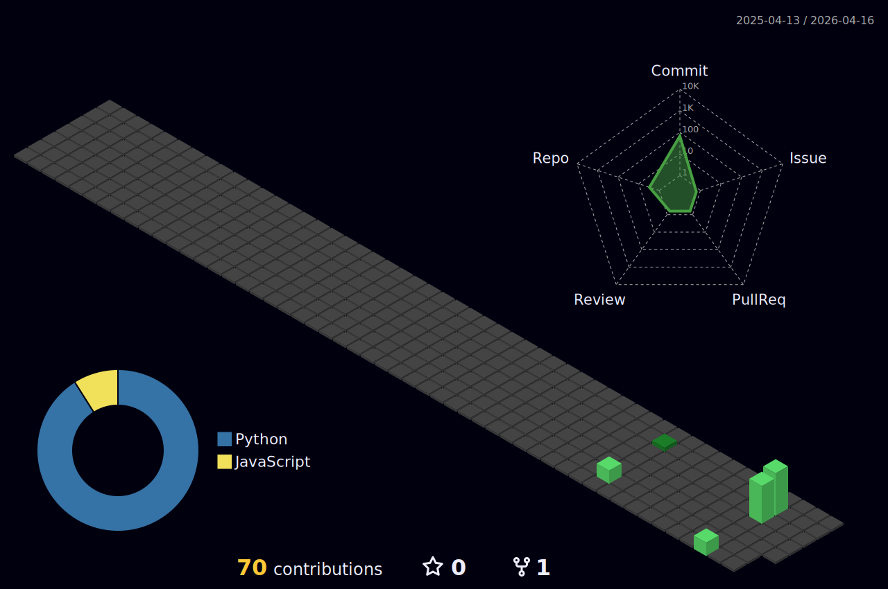

  
  # Hi there, I'm Shivam Tiwari 👋
  
  

  *I am a Full-Stack Developer with strong backend expertise in Java and Spring Boot. [cite: 4] I focus on building scalable RESTful APIs, AI-integrated applications, and responsive web interfaces. [cite: 5] I am currently pursuing my Bachelor of Engineering in Computer Engineering at Lokmanya Tilak College of Engineering. [cite: 29]*

  **Contact:** shivamtiwari01016@gmail.com [cite: 2]

 

### 🛠️ Technical Skills 

  
  
  
  
   
  
  
  
  
   
  
  
  

 

### 🚀 Featured Projects 
* **AI Email Reply Assistant:** Built a full-stack AI-powered email drafting system integrated with Gmail using a Chrome Extension[cite: 15, 17]. Developed RESTful APIs using Spring Boot (Java 21) to generate responses via the Google Gemini API[cite: 16, 18].
* **Journey Junkies Travel Platform:** Developed a web platform promoting affordable and sustainable travel focused on rural tourism[cite: 21, 22]. Implemented backend logic using Java with MySQL database integration, alongside responsive frontend interfaces[cite: 23, 24].

 

### 🏆 Achievements [cite: 25]
* **INNOSPARK Ideathon:** Finalist (2025)[cite: 26, 27, 34].

 

### 🏙️ My Contribution Architecture

  

 

### 📈 GitHub Stats

  
  

